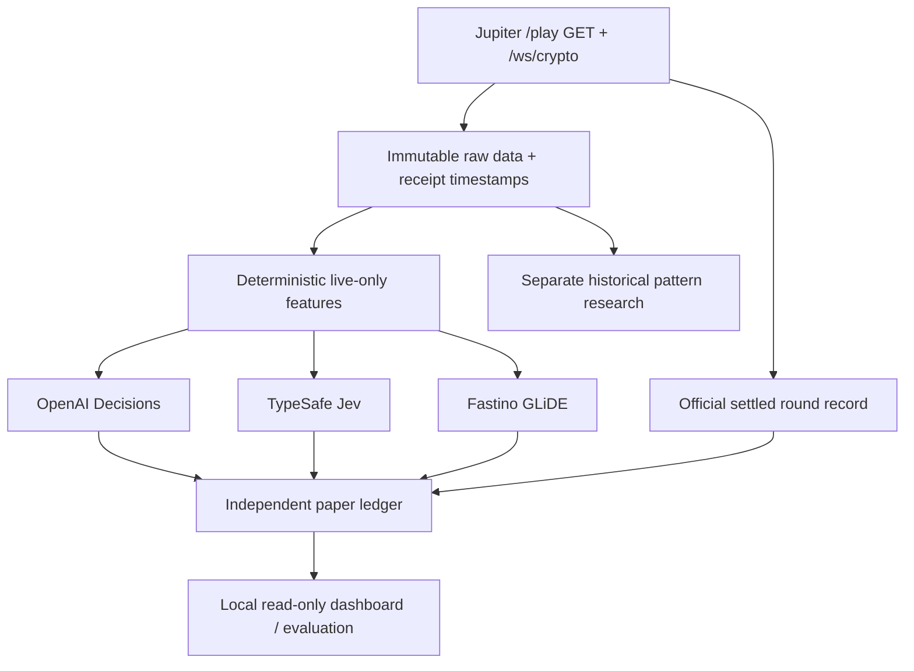

# Arcade Decisions — Jupiter-native research and paper benchmark

> **Status 2026-10-07:** Clean-room executable **V0 foundation**, not a verified live deployment. Offline test suite and synthetic fixture demo run without keys. Real live-paper mode is explicitly **blocked until Jupiter `/play` OpenAPI GET round route and WS message/subscription shape are verified**. Do not claim predictions, verified profitability, or live provider calls from this package.

**One market:** BTC Jupiter Arcade, UPCOMING 60-second round. **Three AI arms:** OpenAI Decisions `gpt-6-luna`, TypeSafe Jev, Fastino GLiDE. **Data:** Jupiter-only. **Mode:** paper simulation, read-only. **No wallet, no signing, no transaction submission, no real trades.** Independent benchmark; Pattern Lab later.

## Wake-up quickstart (macOS)

Requires Node.js >=22.13 (Node.js 24 LTS preferred for built-in SQLite maturity). **No `npm install` needed** for the working starter. This is native ESM JavaScript with no runtime dependencies; migration to strict TypeScript is an optional agent task after wire schemas are frozen.

```bash
unzip arcade-decisions-v0.zip
cd arcade-decisions-v0
cp .env.example .env
# Edit .env and enter OPENAI_API_KEY, TYPESAFE_API_KEY, FASTINO_API_KEY
npm test              # Offline tests
npm run doctor        # Key presence only; will NOT print secret values
npm run discover      # Live read-only OpenAPI audit; requires internet
npm run start:paper   # Start read-only dashboard + live paper together; fails closed on unverified REST schema
```

Then open **http://127.0.0.1:8789** in a browser. Or use two terminals with `npm run paper` and `npm run dashboard` separately.

To collect Jupiter-only raw frames **without any model keys or trading** (safe if the schema is still unknown):

```bash
npm run capture -- 30   # 30 minutes, bounded; no model API calls
```

To harvest a small bounded interval of Jupiter historical timestamp prices (never used as live data):

```bash
npm run harvest -- --from 2026-10-06T00:00:00Z --to 2026-10-06T04:00:00Z --step 60 --limit 240
```

To inspect a **fully offline synthetic example** without any credentials:

```bash
npm run demo
DATA_DIR=./var/demo-fixture npm run dashboard
```

`demo` uses deterministic fictional market rows and fabricated model scores under a segregated database folder. **It is not an API smoke test or evidence of predictive ability.** Live data directory defaults to `./var` and is not tracked in Git.

### If paper won't start

Read `ops/WAKEUP_RUNBOOK.md`. Jupiter `/play` is **not documented in the mainstream Prediction API**, and the historical research reported an OpenAPI contract at the separate `prediction-market-api.jup.ag` host. In this build environment its live schema was inaccessible. `npm run paper` verifies exact GET route existence in the retrieved spec and refuses to run otherwise; live price WS payload requires a separately verified fixture. Missing live ticks cause **SKIP**, never a fabricated forecast.

### Overnight autonomous coding-agent handoff

1. Keep the Mac plugged in and prevent system sleep, e.g. macOS `caffeinate -i` (see `ops/OVERNIGHT_GSD.md`).
2. Install GSD in OpenCode if needed: `npx get-shit-done-cc@latest --opencode --local` (requires network; independently check `/gsd-help`).
3. Start the noninteractive agent with `bash ops/run-overnight.sh` **after** configuring your normal OpenCode coding provider. The script does not install packages, fetch secrets, or bypass permissions.
4. Agent should complete research/source verification, fixtures, adapters, and UI, with bounded repair loops; it must leave live/provider integration marked `BLOCKED` if schemas/credentials are unavailable.

## Repo navigation

| Area | File |
|---|---|
| Product + scope | `docs/00_PRD.md` |
| Evidence and unverified contracts | `docs/01_SOURCE_DISCOVERY.md` |
| System boundaries | `docs/02_ARCHITECTURE.md` |
| Data dictionary + causality | `docs/03_DATA_MODEL.md` |
| Three-provider benchmark | `docs/04_MODELS.md` |
| Statistical protocol | `docs/05_EVALUATION.md` |
| Pattern #726 and scenario lab | `docs/06_PATTERN_LAB.md` |
| Security + runbook | `docs/07_SECURITY.md`, `docs/08_OPERATIONS.md` |
| Dashboard UX | `docs/09_DASHBOARD.md` |
| Real vs unavailable evidence | `docs/10_EVIDENCE_LOG.md` |
| Detailed jobs per phase | `docs/phases/P00.md` to `P09.md` |
| Agent operational contract | `AGENTS.md` |
| Overnight prompt and scripts | `ops/OVERNIGHT_GSD.md`, `ops/run-overnight.sh` |
| Review in morning | `ops/WAKEUP_RUNBOOK.md`, `ops/HANDOFF_TEMPLATE.md` |
| Existing specs | `docs/ARCADE_DECISIONS_V0_RESEARCH_BUILD.md`, `docs/THREE_MODEL_BENCHMARK_V0.md`, `docs/ARCADE_PATTERN_LAB_V1.md` |

## High-level architecture



## What counts as success?

First: live source schema verified, time/receive causality proved, 100+ consecutive prospective observation opportunities, zero duplicated entries or fake wins. Later: compare paired Brier score, log loss, selective hit rate, latency, missing-key/failure rate against base-rate/price-only baselines. Profit must remain **unavailable** until payout snapshots, lock rules and fees are independently verified. Only later consider Pattern Lab and 1,000 plausible next-price paths as a *research-only* candidate; never treat simulation frequency as calibrated probability.

## Sources

- [OpenAI Decisions guide](https://developers.openai.com/api/docs/guides/decisions)
- [OpenAI Decisions HTTP reference](https://developers.openai.com/api/reference/resources/decisions/methods/create)
- [TypeSafe official quickstart](https://docs.typesafe.ai/introduction/quickstart)
- [Fastino GLiDE inference spec index](https://docs.fastino.ai/llms.txt)
- [Jupiter developer docs](https://developers.jup.ag/docs/prediction)
- [GSD OpenCode installation](https://github.com/gsd-build/get-shit-done)
- [OpenCode CLI](https://opencode.ai/v2/docs/cli)

**Reminder:** An AI-estimated 0.62 is not an empirically calibrated 62% win chance. Predictions in this project are observations to evaluate, not investment instructions.
